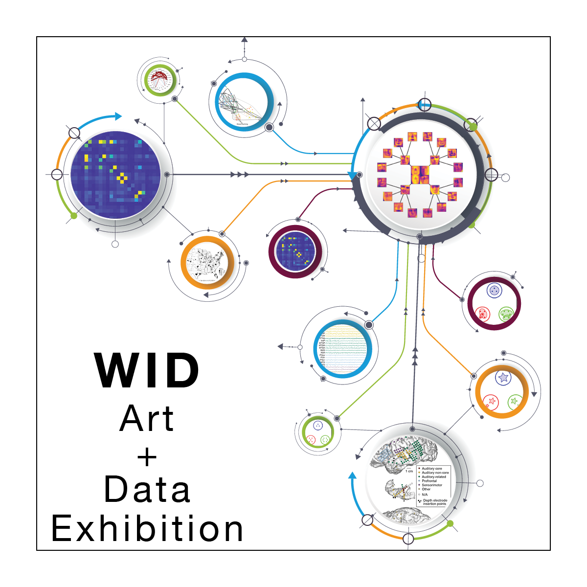

<table class="wide">
<tr>
  <td class="left">
    
  </td>
  <td class="right">

  </td>
</tr>
</table>

# Technical to Beautiful: Data as Art Exhibition

From molecular sequencers to astronomical observatories, scientists have generated rich data about the world around us. At human scales, internet and social media data has shaped our day-to-day lives. All of these developments have taken place in the span of a few short decades, and the pace of data generation only seems to accelerate. In spite of the pervasiveness of data, questions around it tend to be framed more narrowly, with an emphasis on its mathematical or computational aspects. However, recent years have seen a paradigm shift in our perception of data, as reflected in projects such as The Art of Data in the Museum of the City of New York and the Rand Art + Data initiative. In addition to being a collection of measurements of our universe, data is now also perceived as an artistic entity with a human dimension, one that elicits intellectual and emotional responses. 

Stay tuned for 2024!

# Thanks!

The event could not have been possible without the planning and financial support of:

- [Wisconsin Institute for Discovery](https://wid.wisc.edu/)
- [Data Science Institute](https://datascience.wisc.edu/institute/)
- [Department of Statistics](https://www.stat.wisc.edu/)

    
    

# Meet the organizers

Originally from Mexico City, Claudia Sol&iacute;s-Lemus is an assistant professor at the [Wisconsin Institute for Discovery](https://wid.wisc.edu/) and the [Department of Plant Pathology](https://plantpath.wisc.edu/) at the [University of Wisconsin-Madison](http://www.wisc.edu). 

    

        

            
        

        

            Pronouns: she/her  
            <a href="https://namedrop.io/claudiasolislemus">Name pronunciation</a> 
            <a href="https://solislemuslab.github.io/">Lab website</a> 
            <a href="https://scholar.google.com/citations?user=GrUypj8AAAAJ&hl=en&oi=ao">Google scholar</a> 
            <a href="https://github.com/crsl4">GitHub</a> 
            <a href="https://solislemuslab.github.io//pages/people.html">Contact Info</a> 
        

    

 

Kris Sankaran is an assistant professor at the [Department of Statistics](https://www.stat.wisc.edu/) at the [University of Wisconsin-Madison](http://www.wisc.edu). 

    

        

            
        

        

            Pronouns: he/him  
            <a href="https://krisrs1128.github.io/LSLab/">Lab website</a> 
            <a href="https://scholar.google.com/citations?user=d20VuzsAAAAJ&hl=en&oi=ao">Google scholar</a> 
            <a href="https://github.com/krisrs1128">GitHub</a> 
        

    

 
