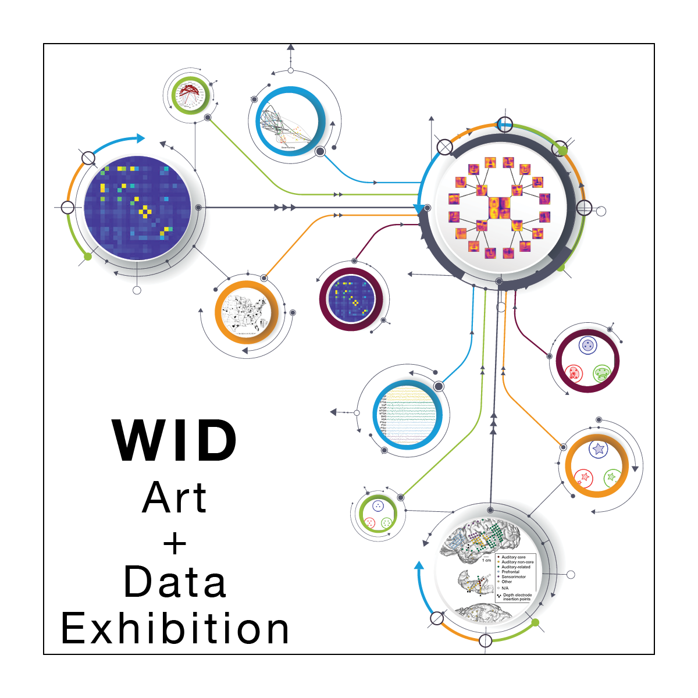

# 2023: Technical to Beautiful Data as Art Exhibition

<table class="wide">
<tr>
  <td class="left">
    
  </td>
  <td class="right">

  </td>
</tr>
</table>

From molecular sequencers to astronomical observatories, scientists have generated rich data about the world around us. At human scales, internet and social media data has shaped our day-to-day lives. All of these developments have taken place in the span of a few short decades, and the pace of data generation only seems to accelerate. In spite of the pervasiveness of data, questions around it tend to be framed more narrowly, with an emphasis on its mathematical or computational aspects. However, recent years have seen a paradigm shift in our perception of data, as reflected in projects such as The Art of Data in the Museum of the City of New York and the Rand Art + Data initiative. In addition to being a collection of measurements of our universe, data is now also perceived as an artistic entity with a human dimension, one that elicits intellectual and emotional responses. 